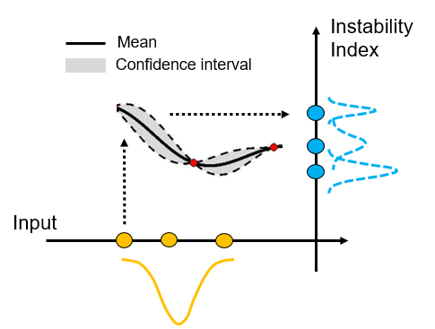
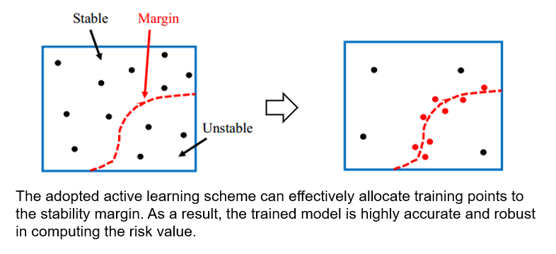
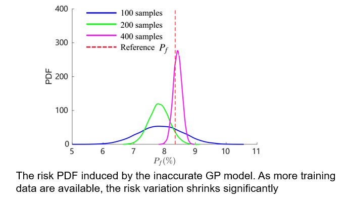
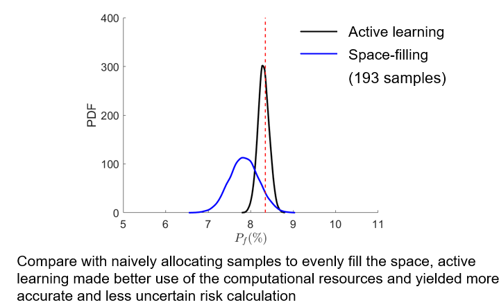

## Reliable Risk Estimation Using Imperfect Machine Learning Model

  

### 1. Highlight

- This work improved the reliability of risk calculation when using a machine learning model trained with limited data..
- We trained a Gaussian Process model to approximate physical simulations with limited training data, and we quantified the risk prediction variations induced by the model uncertainty.
- We developed and tested an active learning scheme, which allows training an accurate machine learning model with 50% of the training dataset.

This work was initially presented in [ASME Turbo Expo 2020](https://event.asme.org/Turbo-Expo-2020), and was later published in the journal:

Guo S., Silva C. F., Polifke W., [Reliable Calculation of Thermoacoustic Instability Risk Using an Imperfect Surrogate Model](https://asmedigitalcollection.asme.org/gasturbinespower/article-abstract/143/1/011010/1092194/Reliable-Calculation-of-Thermoacoustic-Instability?redirectedFrom=fulltext). *Journal of Engineering for Gas Turbines and Power*, 2021, 143(1), pp. 011010.

### 2. Motivation

Using machine learning models to approximate the expensive-to-evaluate physical solvers is a common practice adopted by the gas turbine community to accelerate risk/uncertainty analysis. However, in practice, in practice, it is not uncommon that only a small number of data points can be afforded for model training, due to the high computational cost associated with generating training samples. 

As a result, epistemic uncertainty may be introduced by such an “inaccurate” model, provoking a variation of instability risk calculation, thus compromising the goal of building a reliable gas turbine product.

### 3. Methodology

In this work, we first quantify the variation of risk calculation induced by the “inaccurate” machine learning model. Subsequently, we adopted an active learning scheme to intelligently allocate training samples such that the trained GP model is highly accurate particularly in the vicinity of the instability margin. As a result, As a result, a more accurate and robust instability risk calculation is obtained without increasing the computational cost in model training.

  

### 4. Results

- We successfully quantified the risk variation induced by the “inaccurate” Gaussian Process model.

  

- Our proposed active learning strategy produced a more accurate and robust risk calculation without increasing the computational cost in model training.

  

### 5. Folder structure

**1. Presentation**: the slides presented in [ASME Turbo Expo 2020](https://event.asme.org/Turbo-Expo-2020) conference.

**2. MatlabScripts**: MATLAB source code and data to reproduce the results. The code and data are organized in individual folders corresponding to different sections in the paper. 

- **PDF_converge.m**: to train GP model using either space-filling method or adaptive-sampling method. 

- **U_converge.m**: to show the convergence history of the adaptive training process.

- **Adaptive_postprocess.m**: to compare the performance between adaptive method and passive method.

- **RobustGP_v3.m**: to calculate risk factor PDF by considering GP uncertainty

- **Cov_calculator.m**: to draw correlated samples from a trained GP model

- **ErrorPf.m**: to visualize the performances of both methods

- **ModelTraining**: this folder contains utilities required by GP training methods.

- **HelmholtzCase**: this folder contains data/routines to reproduce the results associated with the Helmholtz case.

Pre-install UQLab (www.uqlab.com) is necessary to run the code
